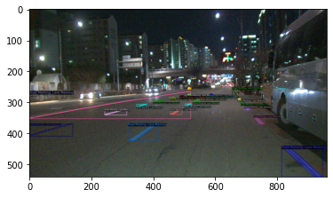
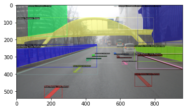
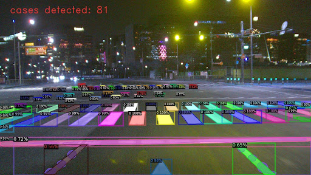
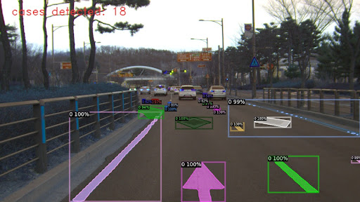

##  Roadmark Segmentation with Detectron2

 

### Dataset 
Dataset used: 30,801 images
Number of classes: 3


<p float="left">
  
  

</p>


labelled image 

in folder <tools> there is a merge_cocoJson.ipynb notebook 
notebook fumctions: 
    - merge multiple json files into single json file
    - create bbox from segmentation labels 
    - reindexing annotataions's and images's id 
    - is_crowd -> iscrowd (error solved)


The segmentation output of the model on a sample image are shown below.


<p float="left">
  
   
</p>

### Installing dependencies

#### first open your terminal and clone the repository on your specified folder of local machine. 
the project was tested in linux ubuntu OS
```
git clone https://github.com/EldorIbragimov/RoadCare.git
```

#### Using conda create new enviorenment with python version==3.8 or newer
```
conda env create -n road_seg_env python==3.8

conda activate road_seg_env

pip install -r requirements.txt
```


### Usage of the module

#### training 

first to go folder segmentation/input/ and open data_path.json to enter your data name and paths for images and json file
 ```
data_path.json

  {"train_dataset_name" :"road_coco_train",
  "train_image_path" :"./input/testData2/train/",
  "train_label_path" : "./input/testData2/train/road_train_json.json",
  "validation_dataset_name" : "road_coco_valid",
  "validation_image_path" : "./input/testData2/valid/",
  "validation_label_path" : "./input/testData2/valid/road_validate_json.json"}
```
 go to segmentation folder and run below command on your terminal for training. Befora specify network architecture, epochs, batch size and so on or it will use default values
```
python train.py

#or
python train.py --help # to see input variables 

```

#### evaluation 

for evaluating the trained model, run below command on your terminal 
```
python train.py --task eval # default is train. 
```
there is train_eval option which do train and eval together. you should set --eval_period . see default values for guide 


we also have notebook dectron2_roadmark.ipynb that have data visualization / trainig / evaluation 


#### inference 

for inference, run below command on your terminal 
```
python infer.py

#or
python infer.py --help # to see input variables 
```
to test differet images, use "--images" flag  and specify your data path as shown below
you can chack test result  in "output" folder. 
```
python infer.py --images ./input/Data/test/

```

#### inference  for extracting mask, image, masked images of every single detected insntance 
run below command on your terminal as above but with flag < --task mask > and specify which classes you want to process < --class_num (0, 1, 2)>

```
python infer.py --task mask --class_num (0, 1, 2)

```
for a guide please check default values in code 


#### if you want to test without training, download trained weight for this dataset and place it in spesified folder 
link: <a href="https://drive.google.com/file/d/1_MSHem9fZeUW4qPg9F3WhfJHNrwafDYb/view?usp=sharing">model_final.pth</a> 


folder structure: 
```
    --segment
      --input
        --dataset
          --train
            img1
            img2
            ....
            train.json
          --valid
          --test
        data_path.json
      --output
        --infer_out
        --seg_new
          model_final.pth
          cfg_road.pickle
      train.py
      infer.py
```


#### dataset folder strucutre 


    ```
    --dataset
    ----road_data
    ------train
    ---------Image1
    ---------ImageN
    ---------train_annotation.json
    ------validation
    ---------Image1
    ---------ImageN
    ---------val_annotation.json
    ```

#### ******************
